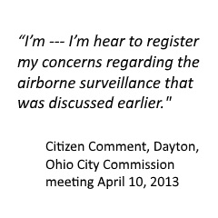
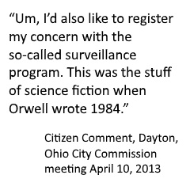
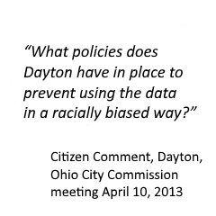

--- 
title: "Data Analytics for the Public Good"
date: "Spring 2019"
site: bookdown::bookdown_site
output: bookdown::gitbook
documentclass: book
biblio-style: apalike
link-citations: no
description: "A course focused on data-driven practices for public sector organizations."
---
```{r include=FALSE, cache=FALSE}
knitr::opts_chunk$set(
  warning = FALSE,
  message = FALSE,
  comment = "###",
  collapse = TRUE,
  cache = FALSE,
  out.width = "90%",
  fig.align = 'center',
  fig.width = 8,
  fig.asp = 0.618,  # 1 / phi
  fig.show = "hold"
)


```


# Welcome {-}


> **DATA ANALYTICS FOR THE PUBLIC GOOD:**
>
> **Building Data-Driven Organizations in the Public and Nonprofit Sector**
>
> _**Watts College of Public Service and Community Solutions, Arizona State University**_


--- 

This collaborative text was created through efforts of students in the ASU course [PAF 586: Data for the Public Good](assets/Syllabus-PAF-586-Spring-2019.pdf). The class covers topics about the sources and uses of data in modern organizations, with goals of understanding management approaches to:

* Harness large-scale data to inform policy design, increase stakeholder engagement, and improve service delivery.
* Intelligently consider the social, political, and ethical considerations of data in the public sector. 

This text is meant to provide a broad overview of these topics, broken out into themes, with suggestions about how to best integrated new methods and best practices of data collection, management, and utlization. We draw heavily from the following texts:

1. Pentland, A. (2015). *Social Physics: How social networks can make us smarter.* Penguin. 
2. Meier, P. (2015). *Digital humanitarians: how big data is changing the face of humanitarian response.* Routledge.  
3. Eagle, N., & Greene, K. (2014). *Reality mining: Using big data to engineer a better world.* MIT Press.  
4. O'Neil, C. (2016). *Weapons of math destruction: How big data increases inequality and threatens democracy.* Broadway Books. 
5. Duhigg, C. (2016). *Smarter faster better: The secrets of being productive.* Random House. 
6. Sutherland, J., Sutherland, J. J. (2014). *Scrum: the art of doing twice the work in half the time.* 


## Authors

The following students in the course have contributed the chapter summaries and best practice overviews. 


1. Lindsey Duncan 
1. Rachael Goodwin  
1. Erin Hart  
1. Thomas Kolwicz 
1. Carlos Lopez 
1. Joseph Lynch 
1. Julie Moore 
1. Marcela Morales 
1. Lorna Romero 
1. William Seeley 
1. Matthew Simon 
1. Dennis Stockwell 
1. Justin Stoker 
1. Lauren Zajac 


 


<!--chapter:end:index.Rmd-->

```{r include=FALSE, cache=FALSE}
knitr::opts_chunk$set(
  warning = FALSE,
  message = FALSE,
  comment = "###",
  collapse = TRUE,
  cache = FALSE,
  out.width = "90%",
  fig.align = 'center',
  fig.width = 8,
  fig.asp = 0.618,  # 1 / phi
  fig.show = "hold"
)


```
# The Big Promise of Big Data


*William Seeley and Lauren Zajac (Team 1)*

## Topic Overview


The readings this week spent a great deal of time unveiling the potential, power and promise of big data including
what McKinsey and Company referred to as: 

“the new frontier for innovation, competition and productivity”.  

Big data has the promise to drive changes as profound as the industrial revolution according to GE and in 2017 the Economist 
stated that:

“Data is to this century what oil was to the last century: a driver of growth and change”.   

One of the key insights in the readings this week is that information overload, or too much information, can be as bad as a lack of information.   Industries and companies who can utilize data specialists and new technology and tools to work with the data will have a 
competitive edge.

  


## Chapter Summaries

### Social Physics **CH1 From Ideas to Action**

Alex Pentland examined the tremendous potential of the new frontier of big data during chapter 1, entitled 
“From Ideas to Actions” when he presented his concept of social physics.  He contends that while the 
internet makes our lives more connected, they also make things go faster, and that we are “drowning in information, 
so much that we don’t know what items to pay attention to, and what to ignore” (p. 2).  This overwhelming volume and speed of 
information forms virtual crowds across the world in minutes, leading to catastrophic events like stock market crashes and 
downfall of governments (p.2).  He recognizes that people can no longer be seen as independent decision makers, and that the
internet and social media-fueled interactions must be examined to fully explain and predict human behavior.  
Social physics is defined as “a quantitative social science that describes reliable, mathematical connections between information 
and idea flow… and people’s behavior” (p. 4).   We are able to understand how ideas flow between people using social learning, 
and how this flow “shapes norms, productivity, creative output” (p. 4).  Understanding the information flow and resulting changes
in behavior is critical to understanding social physics.  Furthermore, social physics is made possible through Big Data, which 
tracks our “digital bread crumbs” of all aspects of our lives and choices (p. 8).  In addition to assisting social scientists
with “reality mining”  or analyzing patterns within these digital bread crumbs, big data also allows us the opportunity to view 
society and its complexity “many orders of magnitude over prior social science sets” (p. 11).  Pentland also issues some warnings
on the age of Big Data, and he urges that scholars and researchers follow strict scientific policies to ensure the protection 
of privacy at all costs.

### Digital Humanitarians **CH1 Rise of Digital Humanitarianism**

Patrick Meier dives further into the potential of Big Data, and then discusses his own personal entry into Digital 
Humanitarianism in Chapter 1, “The Rise of Digital Humanitarianism”.  He describes his own personal brush with tragedy 
when his wife was in Port-au-Prince, Haiti, conducting research in 2010 when the devastating earthquake hit.  Feeling 
hopeless and powerless, and struggling with the lack of communication or information, Patrick and his growing network of 
friends and contacts and volunteers began to launch a “Crisis Response Map” and became digital humanitarianisms.  They 
used the power of social networks and big data information to create, publish and maintain this digital map that pinpointed 
the worst areas of the disaster and earthquake impact and cries for help in a single map.  This was made possible with 
thousands of volunteers world-wide who devoted hours for many weeks, translating and posting messages, and the map became 
the source of information from the press, emergency response teams, and friends and family members seeking information on 
their missing and affected loved ones.  Big data and the internet allowed these thousands of volunteers to do something 
tangible to help during the crisis, and has forever changed the way we can respond to disasters.  Meier cautions that 
Big Data and the overflow of information and data can also be “as paralyzing as the absence of data” (p. 18) and needs to be managed.

### NYT **The Age of Big Data**

Steve Lohr continues this explanation of the power and promise of Big Data in his 2012 Article, *“The Age of Big Data”* published 
in the _New York Times_.  He states that Big Data is a *“new economic asset, like currency or gold”*.  Big Data has given rise 
to a fast growing career field of data consultants who are available and adept at analyzing the data to help industries “make 
decisions, trim costs and lift sales” using Big Data (p.2).  And this Big Data is growing, as it “more than doubles every 
two years”, and creates an “on-line fishbowl…into the real time behavior of huge numbers of people” (p. 6).
Lohr goes on to provide a number of illustrations on how pervasive the use of Big Data is by presenting a number of 
examples in all industries, including business, sports, governments, and academics.  Big Data has also fueled the growth 
of new computer technologies to harness and analyze the data, including artificial intelligence, natural language processing, 
pattern recognition and machine learning.  Lohr also mentions that there is a feedback loop and that additional data 
actually helps make these tools better.  Finally, Lohr also cautions that there are some drawbacks to the data, including 
false discoveries, all of the data makes as it is hard to focus on what is meaningful, biased fact finding, where people 
look for data that support their theory, and limits to statistical and mathematical modeling.  But drawbacks aside, 
Big Data has caused a revolution and paradigm shift.  People are no longer relying on intuition or feelings in their industries, 
but are rather focused on the data and analysis.


## Key Take-Aways (for Yellowdig)

[VIDEO](https://voicethread.com/myvoice/thread/11963613/71077645/66681745)


### Discussion Questions

1. Meier cautions that Big Data and the "overflow of information and data" can also be “as paralyzing as the absence of data” (p. 18).    Describe a time when you encountered "too much of a good thing (data)" and what were some strategies you used to overcome the problem?  

2. In his article, "The age of Big Data", Lohr mentions that  enthusiasts say that the Big Data has the potential to be "humanity's dashboard" with numerous helpful and positive uses, while critics argue that it is just "Big Brother" invading people's privacy.  What is your feeling on Big Data?

3. Meier talks about the tangible results (Digital Humanitarianism!) That they found from the use of big data, is there a time that you used data and had immediate results? 


## References

1.	Pentland, A. (2015). *Social Physics: How social networks can make us smarter.* Penguin. **CH1 From Ideas to Action**
2.	Meier, P. (2015). *Digital humanitarians: how big data is changing the face of humanitarian response.* Routledge. **CH1 Rise of Digital Humanitarianism**
3.	The Age of Big Data: New York Times  [ LINK ](https://www.nytimes.com/2012/02/12/sunday-review/big-datas-impact-in-the-world.html)


<!--chapter:end:ch01.Rmd-->

```{r include=FALSE, cache=FALSE}
knitr::opts_chunk$set(
  warning = FALSE,
  message = FALSE,
  comment = "###",
  collapse = TRUE,
  cache = FALSE,
  out.width = "90%",
  fig.align = 'center',
  fig.width = 8,
  fig.asp = 0.618,  # 1 / phi
  fig.show = "hold"
)


```
# Information Blindness


Team 2 - Matthew Simon and Carlos Lopez

## The Challenge of Big Data: Information Blindness 

## Topic Overview

In this module’s reading the three authors pose challenges to the idea of “big data” and its actual usefulness to those that intend to use it. Patrick Meier defines big data as high volume, velocity and variety (Page 28). He uses the idea of social media to make this point. Overall, the theme between these three readings are how people are blind to the data they are collecting, its usefulness and how the user is analyzing the data they are receiving.

Let’s take measuring impact for example. Non-profit and government agencies are always trying to demonstrate how they are measuring impact and what their contribution to society is. For business, this story is a little less complicated as they are primarily focused on profitability. However, in social organizations the overarching vision is a little more complex than measuring profitability. A common theme throughout the readings discuss clarity in purpose and focus on the outcome. Are we truly measuring what it is we (the organization) cares about? Are we actually collecting the data in which we need to in order to be able to measure what we care about? Or an even larger philosophical question posed by Gugerty and Karlan, do we (the organization) actually even know what we care about. 

In our ever-increasing technological world, we are bombarded with immense amount of information. All of the texts outline human’s ability to process large amounts of information. But they also demonstrate the short comings of humans being able to analyze data or how we react to it if it is not digestible in a way to be useful or meaningful. Duhig calls this the shoving everything in the drawer response. 

For us, the biggest over-arching theme to these readings is data’s connection to the work an organization is actually doing and how it can be utilized to amplify work. You can’t just be ok with massive data collection and not using it. Then it is just a waste of resources. Or if you are attempting to use it and using it in a way where people are blind to it or overwhelmed by it, then it becomes an even further waste of resources. You have to be clear about what it is you are striving for and what it is you want to collect. You cannot collect data and analyze before you are clear about why you are collecting and what it is you want to do with it. 
	
Duhig makes excellent points with regards to the education parallels he draws. Government policies have been pushing big data collection on students and student achievement for the past 20 years. The reality is that policymaker’s hearts were in the right place, but local schools were ill-equipped to process this data. Teachers would become overwhelmed to this data and weren’t using it in a way that could be useful to their students. Teachers first needed to understand what they were assessing and why they were assessing it. Then they needed to understand how far into the data they were going. If a teacher gives a comprehensive assignment on many topics from an English unit and they only look at the overall grades on tests; they are not going to know what they need to do in order to better prepare different groups of students on their individual needs. The data sets of which they were already collected were too blunt. They needed to understand how students performed on various questions. The data needed to be disaggregated in a better format. Further, there needed to be an investment of time and training in order to better support teachers in utilizing this data.  In addition to receiving information and data, teachers were forced to engage with it.  They did their own analyses, tested hypothesis, tracked tests and measurements.  By engaging directly with the data they were better able to use it to improve student performance.     
	
One of the biggest best practices from these readings comes from Gugerty and Karlan. The reflection questions they pose about theory of change and how to proceed on measuring outcomes is extremely informative. For example, they write: 

“Validating the initial steps in the theory of change is a critical step before moving on to measuring impact. Consider a program to deliver child development, health, and nutrition information to expectant mothers in order to improve prenatal care and early childhood outcomes. Starting an impact evaluation before knowing if expectant mothers will actually attend the training and adopt the practices makes little sense. First establish that there is a basic take-up of the program and that some immediate behaviors are being adopted. Before starting an impact evaluation of a program providing savings accounts, determine whether people will actually open a savings account when offered, and that they subsequently put money into the account. If not, the savings account design should be reconsidered.”

## Chapter Summaries

**Digital Humanitarians by Patrick Meier (Pages 25-31)** 
This section of reading basically looks at the impact of social media as big data and its applicable uses to disaster relief. They talk about the immense amount of social media postings and content and how to parse through it. Not all of the posts are going to be relevant or timely. However, they do discus an opportunity with using this type of massive data availability in response to humanitarian efforts. It all about identifying what you are looking for. 

**Smarter Faster Better by Charles Duhig ( Chapter 8)** 
This chapter gives a variety of practical real-life examples of how people absorb data. From examples in the school system, which were discussed in the topic overview, to examples about people being able to choose retirement accounts. He uses all of these examples to show that people need to be able to absorb and digest data in an effective way in order to process it and make a decision. He calls the human ability to make these choices and breakdown data as scaffolding and winnowing. When people are able to process data effectively it has huge implications for the impact that it is able to have on business operations and even the lives of students. 

**Ten Reasons Not to Measure Impact – and What to Do Instead by Mary Kay Gugerty and Dean Karlan** 
This article focuses on organizations innate want to measure their impact and sometimes being blinded by what they are collecting. Governments and funders are increasingly calling on these organizations to demonstrate what it is they are doing and how those dollars are being used. They layout some of the missteps that current organizations fall into and what to do alternatively. For example, they discuss clarifying a theory of change, deciding on what programs to actually evaluate over others and how to effectively integrate data collection into current workstreams. 


## Key Take-Aways (for Yellowdig)


### Discussion Questions

1.	How are you blinded by data in your current organization? Do you feel overwhelmed by any data that you receive? What do you do when you receive this data?  

2.	Do you feel like you or your organization collect any data that is not used for anything? What is the data point? Do you know why it started being collected? 

3.	Do you feel that your current data procedures in your organization take away time from your work? Do you find data to be informative or not in your current practice? Why? 

4.	Disaster affected communities are increasingly becoming “digital communities” that turn to social media to communicate during disasters and to self-organize in response to crises.  Do you have your own examples of “digital communities” related to your organization and how does your organization work with them?  

## References

* Duhigg, C. (2016). *Smarter faster better: The secrets of being productive. Random House.* **CH8 pp 238-247, 252-267** 
* Meier, P. (2015). *Digital humanitarians: how big data is changing the face of humanitarian response. Routledge.* **CH2 the rise of big crisis data pp 25-31**  
* Gugerty, M. K., & Karlan, D. (2018). Ten reasons not to measure impact—And what to do instead. Stanf. Soc. Innov. Rev.  

<!--chapter:end:ch02.Rmd-->

```{r include=FALSE, cache=FALSE}
knitr::opts_chunk$set(
  warning = FALSE,
  message = FALSE,
  comment = "###",
  collapse = TRUE,
  cache = FALSE,
  out.width = "90%",
  fig.align = 'center',
  fig.width = 8,
  fig.asp = 0.618,  # 1 / phi
  fig.show = "hold"
)


```
# Challenges of Organizational Change


Joseph Lynch
Marcela Morales 

## The Challenges of Big Data: Organizational Change 

## Topic Overview
With over 2.5 Quintillion bytes of data created every day, the greatest challenge to business is how to use this data to improve businesses while making it profitable. 

## Chapter Summaries
Desouza, K. C., & Smith, K. L. (2014). Big data for social innovation (Links to an external site.)Links to an external site.. Stanford Social Innovation Review, 2014, 39-43.
**Big Data for social innovation**

The term “big data” is used to describe the growing proliferation of data and our increasing ability to make productive use of it. The business community has also been a heavy user of big data. Each month Netflix collects billions of hours of user data to analyze the titles, genres, time spent viewing, and video color schemes to gauge customer preferences to continually update their recommendation algorithms and programming to give the customer the best possible experience.  There, a large chasm exists between the potential of data-driven information and its actual use in helping solve social problems.  Social problems are often what are called “wicked” problems. Not only are they messier than their technical counterparts, they are also more dynamic and complex because of the number of stakeholders involved and the numerous feedback loops among inter-related components. Numerous government agencies and nonprofits are involved in tackling these problems, with limited cooperation and data sharing among them. Then there are policy and regulatory challenges that need to be faced, such as building data-sharing agreements, ensuring privacy and confidentiality of data, and creating collaboration protocols among various stakeholders tackling the same type of problem.
There are multiple dimensions to big data, which are encapsulated in the handy set of seven “V”s that follow.
Volume: considers the amount of data generated and collected.
Velocity: refers to the speed at which data are analyzed.
Variety: indicates the diversity of the types of data that are collected. Viscosity: measures the resistance to flow of data.
Variability: measures the unpredictable rate of flow and types.
Veracity: measures the biases, noise, abnormality, and reliability in datasets.
Volatility: indicates how long data are valid and should be stored.
Barriers creating and using big data include the storage of big data in proprietary systems, the regulation on data capture, storage, and curating for accountability, unreliability of data, and the unintended consequence of big data usage. 
Recommendations:
Building global data banks on critical issues
Engaging citizens and citizen science (Citizens can also be enlisted to help create and analyze these datasets)
Build a cadre of data curators and analysts (We need to equip students and analysts with the necessary skills to curate data so as to create large datasets.)

**Making advanced analytics work for you**
Barton, D., & Court, D. (2012). Making advanced analytics work for you. Harvard business review, 90(10), 78-83.

1.	Choose the right date by mastering the environment you already have and exploring surprising sources of information. Be specific about the business problem that needs to be solved or opportunities they hope to exploit. Get the right technology and IT infrastructure to help integrate siloes information (huge issue in government). It will be a continuous flow of information so IT infrastructure that reports in “batches” will not be helpful. 
2.	Identify the business opportunity and determine how the model can improve performance. Use hypothesis-led modeling to generate faster outcomes and outcomes that are more broadly understood by managers. 
3.	Make it simple. 

**Despite big investments in data, many companies have not made it profitable**

Despite big investments in data, many companies have not made it profitable:
https://www.theregister.co.uk/2017/06/07/go_small_on_big_data/

Mountains of cash keep pouring into the titans of big data despite the world's inability to do much of value with their software. Companies like Cloudera and Hortonworks subsequently arose to help mainstream enterprises put this otherwise complex software to work. It's been a lucrative gig, with each company raising hundreds of millions of dollars and, in turn, generating hundreds of millions of dollars in revenue. What none of them has managed, however, is profit, and that's cause for concern. In other words, the money keeps pouring into the big data companies even as their customers generally struggle to figure out how to turn those investments into meaningful outcomes. These big data vendors then have to spend mountains of cash to convince would-be customers that this time it's different, that this time their investment will return "actionable insights" – that illusive dream of data scientists everywhere. Indeed, IDG Research nails it when it finds that "abundant data by itself solves nothing." Companies need to scale back their ambitions to invest in projects that are more evolutionary than revolutionary in nature, looking to tweak rather than overhaul existing operational practices.


**Why Managers hate agile management**

Why managers hate agile management:


In the traditional model, there is a top down model where a vision or product is created and this follows a “relay race” through the various managers, line staff, and sales teams. Each level is assigned a different aspect of the vision or product to achieve an end result. As noted in the article “” Why Do Managers Hate Agile?” (Forbes, 2015), the goal of the traditional model was to “have semi-skilled employees…perform repetitive activities competently and efficiently” and coordinating those efforts so that products could be produced in large quantities.” In the Agile model, speed to service or product is the goal which conflicts with the traditional model by using the concurrent work of many (including private entities) to enhance the product. The traditional manager is used to having control of the outcome of the vision or product and this just does not work in the Agile model which is causing the “tension.” 
To illustrate the differences between traditional and Agile, the Apple IPhone is a good model. If Apple had designed the IPhone using the traditional model, they would release the IPhone with 40 preset applications that they believed were best using consumer input. Once released, Apple would add applications based on consumer demand which would be vetted by management, created by Apple coders, prioritized for release, tested and placed on the platform. This process would be slow and the variation between Apple IPhone would be non-existent. All IPhone would have the same applications loaded. Consumers could seek out competitors with different variations of applications that met their needs. In the Agile method (which Apple uses), Apple created an IPhone with a number of preset applications, however, they have allowed outside entities to create applications based on the public demand. As of March 2018, there were 2.1 million apps available in the Apple App Store. In July of 2008, there were only 800. (https://www.lifewire.com/how-many-apps-in-app-store-2000252) This Agile approach allows the product to stay relevant to the demands of the consumer rather than the vision of the company. Instead of convincing the consumer to buy their product, Apple is giving the consumer what they want as fast as possible.
The Agile method releases or lessens the control that the traditional Manager used to enjoy for the speed and variation that a wider population can create. The speed to market on consumer demand is far beyond what a traditional model can keep up with. The loss of control and power that the traditional Manager has in their product or service is tough to swallow and that is why Mangers hate agile.


## Key Take-Aways (for Yellowdig)

### Discussion Questions
Can data be used to solve social issues deemed “wicked problems” since the infrastructure of non-profit agencies and government do not have the share data in the same way as business.

How can companies and agencies find a way to use big data? Is there a good roadmap to success?

If data is the such a key to success, why are the largest data companies have a problem making profit? 
Why does the Agile model of business conflict with traditional methods of management?

Why do you think that big data is so important in public sector yet the availability is so limited?


## References


* Desouza, K. C., & Smith, K. L. (2014). Big data for social innovation. Stanford Social Innovation Review, 2014, 39-43.  
* Barton, D., & Court, D. (2012). Making advanced analytics work for you. Harvard business review, 90(10), 78-83.  
* Despite big investments in data, many companies have not made it profitable: [ LINK ](https://www.theregister.co.uk/2017/06/07/go_small_on_big_data/)  
* Why managers hate agile management: [ LINK ](https://www.forbes.com/sites/stevedenning/2015/01/28/more-on-why-managers-hate-agile/#186ce9f010ea)


<!--chapter:end:ch03.Rmd-->

```{r include=FALSE, cache=FALSE}
knitr::opts_chunk$set(
  warning = FALSE,
  message = FALSE,
  comment = "###",
  collapse = TRUE,
  cache = FALSE,
  out.width = "90%",
  fig.align = 'center',
  fig.width = 8,
  fig.asp = 0.618,  # 1 / phi
  fig.show = "hold"
)


```
# Challenges of Big Data


Team 4 - Lindsey Duncan and Justin Stoker

## Challenges of Big Data: Ethics and Privacy


## Topic Overview

According to the Pew Research Center, 95% of all adults own some form of a cell phone and as many as 77% of those are smart phones (Mobile Fact Sheet, 2018). Verizon has recently announced their intent to shutdown their 2G and 3G data streams on December 31, 2019, effectively pushing people to 4G or the emerging 5G technology for mobile data (Morris, 2018). Smart phones are just one of the many tools that collect and report anonymous data based upon its user’s location, social activities, financial transactions, browsing history, and information searches. This data is collected and passed through algorithms such as Apple’s Siri, Google Maps and Google AdWords to help predict a user’s schedule, interests, traffic patterns and delays, shopping habits, and more. Big Data is being collected all the time and often without the knowledge of the individual contributors of that data. This section discusses the Challenges of Big Data: Ethics and Privacy.

Whether it is the GPS on a cell phone, traffic cameras, license plate readers, macroscopic infrared imaging, or each other, we are becoming increasingly aware of the amount of information that is being collected about our individual lives. To quote the old English saying, “just because we can, doesn’t mean we should.” This is an example where technology is outpacing policy makers – where policy makers are often just as oblivious to the what’s happening as everyone else.

It is important to discuss the ethics and privacy concerns that come about from the collection of all our individual data. While the vast majority of Americans have no concern and claim to have nothing to hide about their life’s data, many are worried about the eventual public access and public use of that data. “There are 3 Big Data concerns that should keep people up at night: Data Privacy, Data Security and Data Discrimination” (Marr, 2018). Questions that people are likely to ask include:

* Is the information truly anonymous or can it be tracked back to me?
  
* Can my information be used against me?
  
* Is my data going to be used for corporate enrichment or political battles?
  
* Would my data contribute to racial or other discriminatory profiling by government or law enforcement?

While the data collection, in general, benefits everyone by helping with traffic or travel time prediction, allowing your phone to store hours of your favorite stores, sports scores or news from your favorite teams, people have begun to express concern about the use or the public exposure of their personal data for reasons not in the public good. The book Social Physics establishes the social nature of individuals and groups and makes the point how information is passes through those social networks. Currently, social media is used extensively for everything from sharing personal updates, to business marketing, to news and press releases. Even in a book that argues the virtues of the sharing of ideas through social networks, Social Physics acknowledges, “Maintaining protection of personal privacy and freedom is critical to the success of any society” (Pentland, 2015 p. 17).

## Chapter Summaries

### Data that turned the world upside down

This article is about an individual researcher named Michal Kosinski and a Big Data company called Cambridge Analytica.  Kosinski’s research in the field of psychometrics (measuring psychological traits) led to the development of algorithms associating a person’s Facebook likes to the OCEAN (openness, conscientiousness, extroverted, agreeableness, neuroticism) personality instrument.  Kosinski found a person’s digital footprint to be extremely predictive of not only personality, but also other preferences.  Though Kosinski was positive about the uses of his research, he worried about the potential ramifications.  “What would happen, wondered Kosinski, if someone abused his people search engine to manipulate people? He began to add warnings to most of his scientific work. His approach, he warned, ‘could pose a threat to an individual’s well-being, freedom, or even life’ ” (Grassegger, 2017).

Kosinski was concerned when he discovered the work of Cambridge Analytica which has been associated with President Trump’s election campaign and Great Britain’s exit from the European Union (Brexit).  Cambridge Analytica was claimed to have profiled all adults in the U.S., using the data for very targeted electronic marketing during the 2016 presidential election.  Xx Nix, spokesperson for Cambridge Analytica’s marketing strategy, “Cambridge Analytica buys personal data from a range of different sources, like land registries, automotive data, shopping data, bonus cards, club memberships, what magazines you read, what churches you attend… in the U.S. almost all personal data is for sale”(Grassegger, 2017). The company then matches this data and aligns with voter information and the personality profile to identify the target market.

### Eye in the Sky Podcast



Theme is the availability of the data can do a lot of good things, like solve murders, property crimes, etc. but on the other hand there are those that call it a “grotesque violation of privacy” (Eye in the Sky). At what point can public data be taken by a person to track down a cheating spouse? When can it be abused, where do the lines exist?

The Eye in the Sky Podcast details the story of Ross McNutt, a former military officer that utilized surveillance equipment that continuously takes pictures every second over the Town of Fallujah in Afghanistan, to be able to track those that would plant roadside improvised explosive devices (IED). The surveillance equipment would be attached to the underside of an aircraft flying well above the town so that people were nothing more than pixels on a screen. When it was determined that an IED was planted, it was possible to go back and track the person that set the device forward to where they hid or met up with others. The method was effective in tracking down those that would plant the devices. McNutt later separated from the military and established a private company called Persistent Surveillance Systems that would do the same for more domestic towns and cities.

In one example, McNutt demonstrated the use of the technology to track crime in Juarez, Mexico and ultimately pitched the technology in his hometown of Dayton, Ohio. Despite reaching out to the American Civil Liberties Union (ACLU) and local residents, a vocal minority was able to shut down the proposal over concerns for individual privacy.

### Weapons of Math Destruction – Intro pages 1-13
The introduction to the Weapons of Math Destruction text recognizes how the success of Big Data has actually been problematic.  Big Data has been described as more objective than the application of human opinion in decision making. However, Big Data has also served to reinforce human bias when it is programmed into the systems used to collect and to analyze data.  Further, O’Neil points out how difficult it is to challenge the verdict of Big Data because the algorithms and coding are a closely guarded proprietary secret or are so complex they are difficult to decipher.  “Like gods, these mathematical models were opaque, their workings invisible to all but the highest priests in their domain,: mathematicians and computer scientists” (O’Neil, 2017, p 3).



The text highlights the problematic use of data, specifically in the Washington D.C. schools to evaluate teachers.  The schools were using data to evaluate the success of teachers.  Those who scored in the lowest percentiles were separated from employment.  This shows how problems occur with data and algorithms when they are used rather as doctrine rather than suggestions or indicators. It highlights the story of Sarah Wysocki who scored well one year and then was fired the next. People couldn’t explain the algorithm and failed to consider suggestive information that prior year test results on the students may have been altered by their teachers. Recall the disincentives that occur when what gets measured gets managed.   

The underlying purpose of this text is that there are situations where Big Data is being misused and it is done by people that don't understand what they are doing. The author proudly proclaims at the end of the Introduction, “Big Data has plenty of evangelists, but I’m not one of them. This book will focus sharply in the other direction, on the damage inflicted by WMDs *weapons of math destruction* and the injustice they perpetuate. Welcome to the dark side of Big Data.” (O'Neil, 2016, p.13)

## Key Take-Aways (for Yellowdig)

#### Ethics
Users of Big Data should be thoughtful in their approach.  As Cathy O’Neil suggest in Weapons of Math Destruction data can be used for harm even when intended for good.  Programmers and administrators may inadvertently program personal biases into analytical algorithms.  They should be conscientious in their application of the data, ensuring that it is not the only means for evaluating success.  Success is measured as the selection of a candidate for a job, the termination of an employee, the identification of a personal match for dating, the funding of a program, etc. 



Data systems should also be subject to monitoring, evaluation, and adjustment.  If the means for analyzing the data is flawed and hidden behind a proprietary veil, then the system should be opened up to scrutiny.  If you cannot defend it, you probably shouldn’t be doing it.

#### Privacy
The United States needs something similar to the European Union General Data Protection Regulation (EUGDPR) to establish policies with teeth to protect data from breeches and preserve privacy of its citizens.  Better clarity is needed in terms of notification of how businesses are using data. Notifying customers that video recording is in process or a phone call is being recorded doesn’t necessarily mean that people are consenting for their images to be used and linked to other forms of data collection to track personal habits or trends. As Hannes Grassegger and Michael Krogerus note in The Data That Turned The World Upside Down, “The company [Cambridge Analytica] is incorporated in the US, where laws regarding the release of personal data are more lax than in European Union countries. Whereas European privacy laws require a person to ‘opt in’ to a release of data, those in the US permit data to be released unless a user ‘opts out.’ ”

The United States needs a data protection standard that encourages respect of personal data. Penalties for violating data security according to the EUGDPR can be as much as 4% of the annual revenue or €20 million whichever is greater (GDPR, 2019). This penalty is sizable enough to take data security seriously.

### Discussion Questions

  * All organizations collect and store data in some form or another, whether it is for billing, research, marketing, or a host of other reasons. As a manager, am I doing what’s necessary to protect the data that I have from security and privacy breaches?
  
  * Laws currently exist to provide basic security for data protection. Should I be doing more, beyond what is necessary, to protect the data that I have access to?
  
  * Often data can be collected and then processed through algorithms to provide objective performance standards. However data processing is only as good as the programmers that prepared the algorithm. Am I considering the Human element when drawing conclusions from the data I have?
  
  * Do I understand the algorithms or computational methods used to interpret the data? Are they accurate? Are they constantly being improved to consider additional factors/understandings?


## References

* Eye in the sky: [PODCAST](https://www.wnycstudios.org/story/eye-sky) 

* Eye in the sky: [Washington Post](https://www.washingtonpost.com/business/technology/new-surveillance-technology-can-track-everyone-in-an-area-for-several-hours-at-a-time/2014/02/05/82f1556e-876f-11e3-a5bd-844629433ba3_story.html?utm_term=.3be05b5b0d1d)

* European Union: General Data Protection Regulation (2019). Retrieved January 17, 2019 from: [LINK](https://eugdpr.org/the-regulation/)

* Feimberg, H. (2016, January 7). FTC Warns Against Use and Misuse of Big Data Analytics. Retrieved January 11, 2019 from [LINK](https://www.insightsassociation.org/article/ftc-warns-against-use-and-misuse-big-data-analytics)

* Grassegger, H., & Krogerus, M. (2017, January 28). The Data That Turned the World Upside Down. Retrieved January 15, 2019, from [LINK](https://publicpolicy.stanford.edu/news/data-turned-world-upside-down)

* Marr, B. (2017, June 15). 3 Massive Big Data Problems Everyone Should Know About. Retrieved January 17, 2019 from [LINK](https://www.forbes.com/sites/bernardmarr/2017/06/15/3-massive-big-data-problems-everyone-should-know-about/#4eeeb8a96186)

* “Mobile Fact Sheet.” Pew Research Center, 5 Feb. 2018, [LINK](www.pewinternet.org/fact-sheet/mobile/)

* Morris, J. (2018, July 2). Verizon 2G and 3G Sunset Starts. Retrieved January 17, 2019 from [LINK](https://www.digi.com/blog/verizon-2g-and-3g-sunset-starts/)

* O’Neil, C. (2016). Weapons of math destruction: How big data increases inequality and threatens democracy. Broadway Books. Introduction pp 1-13

* Pentland, A. (2015). Social Physics. Penguin Books. p 17

* Header image "cybersecurity" By Titima Ongkantong/Shutterstock.com 

<!--chapter:end:ch04.Rmd-->

```{r include=FALSE, cache=FALSE}
knitr::opts_chunk$set(
  warning = FALSE,
  message = FALSE,
  comment = "###",
  collapse = TRUE,
  cache = FALSE,
  out.width = "90%",
  fig.align = 'center',
  fig.width = 8,
  fig.asp = 0.618,  # 1 / phi
  fig.show = "hold"
)


```
# Collecting Group Data

Collecting Group Data (Team 5)

## Topic Overview

In Chapter 3 of Reality Mining and Chapter 5 of Social Physics we see examples of how we can learn from small groups. In Social Physics, Pentland worked with employers and their employees to conduct short-term experiments in order to improve the productivity of the workplace. He and his team were able to draw out key learnings from the data collected and discovered important links between behavior and social learning opportunities. **Their data showed that the pattern of ideas flowing is central to driving productivity. To take this a step further, their research showed that face to face engagement and exploration were the largest factors influencing productivity and creative output.** (Pentland, 2014) In other words, the more time people spending time interacting with each other, the more ideas could be generated, discussed, and their colleagues would be in the loop, thus resulting in higher efficiency and productivity. 

In Reality Mining, Eagle and Greene discuss the need to expand collecting data from small groups outside the world of academia and opportunities to scale it to address wider community needs using sensors and technology. They acknowledge that small group data collection is often the most difficult type of information to gather because participants are often wary of sharing information that is trackable back to the individual. In small group settings, there is heightened concern about anonymity. **The authors’ central belief is that incentives should be used more by those wanting to collect group data and that given the right incentive, data could be shared freely.** (Eagle and Greene, 2014)

**DISCUSSION**

There is no doubt about the benefit that can come from capturing small group data as these two texts illustrate. However, how realistic is it that nonprofits or government agencies can collect and use such data? Despite the relative ease of collecting the data now, compared to a decade ago, organizations must have the ability to capture the right data that is most meaningful to their work and the expertise to use it to affect the delivery of their programs or services. Further, organizations must have a strategy to use the data and processes to interact and learn from the data. (Barton and Court, 2012) (Duhigg, 2016) Using big data can feel overwhelming for these reasons. Additionally, agencies must commit the resources needed to extract and interpret the date and promote the validity of the investment. Far too often this type of research is considered nonessential and bypassed due to funding or staffing shortages, or simply because we are all too busy. If data and statistics are to be the foundation for decision making, then it must be treated as an essential tool, not a secondary accessory. 

Perhaps a better and more manageable role for nonprofits and government agencies is collecting targeted data on a few key indicators and performing micro tests of focused hypotheses. This would allow them to more easily track, manage and use the data to answer a key research question. For example, an advocacy organization could test what subject lines drive click-throughs to increase the number of advocates taking action via email. A government agency like the Motor Vehicle Division could test alternative strategies to find out what best reduces customer wait times. Some ideas might include creating an express lane, having staff specialize in a particular function and having them focus on those tasks, having staff keep track of frequently asked questions and communicating the answers, thus cutting down the amount of time needed when being helped. It seems like the idea of using big data is good in theory when you have the ability and technology to use it well. For both nonprofit and government settings, using the data in a more strategic, targeted approach could be more manageable and practical. 

## Chapter Summaries

**Reality Mining: Using Big Data to Engineer a Better World
Chapter 3: Gathering Data from Small Heterogeneous Groups**

This chapter explores the potential of collecting data from small groups of people. It discusses the challenges, costs, and benefits of a number of different types of technologies that collect data from small groups. Detailed examples from multiple fields are given, including a look at smart conference badges that track movement and engagement of conference attendees, companies mining data from their employee activity to create a more productive work environment, neighborhoods collecting data to help solve social problems such as reducing pollution and determining the best bike paths, and audio surveillance systems that enable media companies to have a real-time look at how people consume multiple types of media. The authors cite concerns throughout the chapter about maintaining user privacy, legality of data collection, the expense of collecting data, and having the technology available to gather the data efficiently. Despite these concerns, the authors believe that the biggest challenge of group data collection is finding the right incentives. They argue that if the benefits of the data collection outweigh the costs, individuals would be more willing to share their data and companies who want that data should compensate people appropriately.

**Social Physics: How Social Networks Can Make Us Smarter
Chapter 5: Collective Intelligence-How Patterns of Interaction translate into Collective Intelligence**

In Chapter 5 of *Social Physics,* researchers detail their findings regarding networks and exploration. Their findings indicate that the pattern of idea flow was the single most indicative element of a successful group.  When groups featured characteristics such as equal participation, turn taking, and high engagement with other members, the group was likely to have high performance. Researchers summarized that when these group conditions exist, it will likely result in a large volume of ideas being generated and filtered in a group process with a majority consensus being gained. When a network functions in this capacity, research indicates they have a higher efficiency and yield a more creative output.  These groups had a higher level of collective intelligence than group that did not function in this format.

In order to develop the volume of ideas, the members of the group must actively engage in ‘exploration’ whereby they venture outside of the network to gather unique data and return to the network to add it to the collective stockpile of information. Once this “idea dump” has been completed, the network reconvenes as a unit to filter and evaluate it. Once completed, any ideas or information that are deemed valuable or actionable by the majority are put into practice. 

## Key Take-Aways (for Yellowdig)

[Collecting Group Data](https://youtu.be/rVVe32ORLts)

### Discussion Questions

In one case, a company subsidized the cell phone equipment and service for people participating in a study that tracked their media consumption. Their phones were enabled to listen to everything that user experienced and took short snippets of sound and matched those against a database to see what movies, songs, TV shows, or other media a person may be listening or watching. For you, if a company offered to pay your cell phone bill, would you give them an all-access pass to listen to your life? Describe your answer.

Follow Up: This was published before the mass introduction of Amazon’s popular “Alexa” gadget. Do the recent incidents around Alexa’s unauthorized recordings and subsequent invasion of privacy influence your answer? In regards to the previously mentioned cell phone research, do assurance that conversations and other non-research related recordings are to be deleted and discarded appease you? 

In another case, the authors talked about companies monitoring their employee’s activities, including phone calls, activity on their computers, emails, recording of phone calls, movement around the office or text messages. Companies do this to better understand the social networks of their employees, connect staff with similar needs or interests, detect potential fraud, track productivity, and other things. Would you be comfortable working for an employer who is watching your every move? What benefits or incentives would your employer have to provide to make you comfortable with this?

In one case study, the author noted the productivity of a team increased when the members of the team were given a collective break, as opposed to staggered break times, allowing them to have more face-to-face interactions. The conclusion was that more engagement translated to better efficiency as a team. Do you find this to be true in your own work setting? Is there a point of too much “collectiveness”?

Does the research showing high functioning networks are a result of equality, turn taking, and engagement surprise you? Is this something we all learned in kindergarten but have to relearn in adulthood?

## References

* Barton, D., & Court, D. (2012). Making advanced analytics work for you. Harvard Business Review, 90(10), 78-83. 
* Duhigg, C. (2016) *Smarter faster better: The secrets of being productive in life and business.* Random House. New York, NY.
* Eagle, N., & Greene, K. (2014). *Reality mining: Using big data to engineer a better world.* MIT Press. CH3 gathering group data  
* Pentland, A. (2015). *Social Physics: How social networks can make us smarter.* Penguin. CH5 observing people in organizations  

<!--chapter:end:ch05.Rmd-->

```{r include=FALSE, cache=FALSE}
knitr::opts_chunk$set(
  warning = FALSE,
  message = FALSE,
  comment = "###",
  collapse = TRUE,
  cache = FALSE,
  out.width = "90%",
  fig.align = 'center',
  fig.width = 8,
  fig.asp = 0.618,  # 1 / phi
  fig.show = "hold"
)


```
# Processing Satellite Data


Team 6 - Tommy Kolwicz and Dennis S Stockwell

## Topic Overview
The three references take us through the current best practices for collecting and analyzing different types of imagery and how the public can be used to help process large volumes of data.  It is not humanly possible for imagery experts and scientists to analyze the massive amount of satellite, and soon UAV, imagery collected on a daily basis.  Crowd sourcing the detection and flagging of whatever the item of interest happens to be is the most efficient method in place today.  Incredibly, no matter what the topic of interest is, the public wants to help.  Humanitarian, scientific, wildlife preservation, archeological, all have found a following.  

The only things that have been shown to do a better job than humans in analyzing imagery are machines.  The second reading takes us to the role AI and machine learning is playing in the processing of data and how we are teaching AI, through crowd sourced training sets, to process data so that interpretation can be done at a larger scale and faster.  Time is the element that we are continually attempting to harness.  The last reading transitions us to consider the implications of massive campaigns of data collection.  Clearly this is a technological capability that we currently possess.  The article poses the question, “Should we?”.  The article also ponders whether people truly understand how the data will be used and what privacy we may be giving up for the proposed positive outcomes associated with the data collection.  


## Chapter Summaries

### Crowd Computing Satellite and Aerial Imagery
### Digital Humanitarians by Patrick Meier (Chapter 4)

Big Data Fusion, or using multiple different sensor systems and web tools in an integrated manner to produce a coherent operational picture, is the future of crowd sourced Digital Humanitarian work; this is referred to as microtasking.  Recent history has shown that there are a number of sensor systems that can be used to collect needed imagery to do the necessary analysis required in a crisis.  

On one end of the spectrum, you have extensive, and expensive, satellite imagery.  In 2014, satellite imagery was provided to digital humanitarians online to help in the search and rescue operations of Malaysia Airlines flight 370.  In just four days, 8 million volunteers had combed over 400,000 square miles of ocean and land.  Crowd sourced imagery analysis has helped try to find the grave of Genghis Khan, search for Steve Fossett’s missing airplane, identify the number of shelters in Somalia, and tag galaxies for astrophysicists.  

For much cheaper, digital humanitarians can buy Unmanned Aerial Vehicles (UAVs).  These are becoming less expensive by the day and can be used to collect images of large areas or many images of focused areas.  Either way, UAVs are unaffected by clouds or other atmospherics that can cause trouble for satellite images.  On the very inexpensive end of the spectrum are kites and balloons.  In 2010, balloons and kites that could produce pseudosatellite images were used to document the BP oil spill and the magnitude of destruction.  

No matter the method of collection, the crowd sourcing of analysis is what can make this methodology so powerful.  Now, some organizations’ are even experimenting with crowdsourcing the crowdsourcing.  In this manner, the most accurate and efficient digital humanitarians are assigned to review the work of others.  The most important images are then sent to professional analysts to review and eventually disseminate to the stakeholders on the ground. 

Just as texts and images were the medium used to create crisis maps in aiding emergency response during natural disasters and search and rescue operations, aerial selfies, using small personal UAVs, are already beginning to join the world of crisis mapping.  Now aerial views of points of interest to digital humanitarians can be added to a crisis map and combined with tweets and pictures from Image Clickers.  The result…Big Data Fusion. 


### Artificial Intelligence in the Sky
### Digital Humanitarians by Patrick Meier (Chapter 6)

When it comes to Satellite imagery the sheer quantity of images is now outpacing even the ability of microtasking by crowdsourcing.  “Microtasking alone can’t actually keep up with 1.5 million square miles of new satellite imagery produced every day – a figure that will increase substantially within just a few years.”  Enter the machines.  That’s right, just like something out of a 80s movie with Arnold Schwarzenegger, one solution being researched is machine learning and artificial intelligence.  Machine learning has shown a lot of capability in the organizing and prioritizing of pictures from disaster response using many of the same techniques as with letters and words.  Automated imagery analysis has shown to be extremely effective.  In Haiti, the European Commission’s Joint Research Center (JRC) showed a 92% accuracy rate in automatically identifying rubble-filled areas.  Unfortunately, “image-based machine-learning classifiers do not ‘port’ well.”  In other words, one classification system for one area does not necessarily work for classification in another disaster response in another area.  

Satellite imagery has also been shown to be useful in following refugee migration, estimating building size, and other aspects of disaster relief using such imagery characteristics as shadows.  The hard part is getting satellite imagery inside the 24-hour threshold window for being able to have an impact.  

Organizations like Galaxy Zoo have demonstrated that using the crowdsourced human-classified imagery to “train” the machines, they have been able to achieve classifications accuracy greater than 90%.  Eventually, at least for Galaxy Zoo, the machines began to outperform the humans and put the volunteers on the sidelines.  However, volunteer microtaskers are still needed to create new machine training sets.  

UAV imagery is about to become as much of a “big data problem” as satellite imagery.  But creation of training sets for machine learning to make sense of UAV images is already underway via crowd sourcing and microtasking.  The University of Maryland’s Institute for Advanced Computer Studies has already developed specialized software to automatically identify Rhino poachers and even the type of weapon they are carrying via pattern-recognition algorithms.  These techniques could be easily applied to humanitarian disasters.  


### Eye in the Sky
### Radiolab Podcast https://www.wnycstudios.org/story/eye-sky

Radiolab Podcast: Eye in the Sky was sponsored by Radio Lab a Radio Program on WYNC a public radio station in New York City. The podcast included Manoush Zomorodi and Alex Goldmark from the podcast “Note to Self” and Mr. Ross McNutt the CEO of Persistent Surveillance systems.  Mr. Ross McNutt had been a 20 year Airforce Veteran that was part of an Air Force Team looking at how to reduce the deaths as a result of IED attacks in IRAQ. McNutts team developed a system (Project Angel Fire) that photographed a large area and took photos at 1 per second creating a snapshot in time that can be reviewed later. Once an incident has occurred or has been reported, those photos can be looked at in reverse time.  Starting from the incident in 1-second intervals in an effort to discover when the device was planted.  If the vehicle responsible for the IED can be identified, the technology can also help answer multiple other questions.  Where did the car come from?  Did it pickup anyone up?  Where did it start?  The photographs can also be played forward post-event to see where the vehicle went after planting the device.  As a result of the review of the photographs Security Forces can be sent to the most likely location of the terror cell.  

The Podcast looks at the Project Angel Fire concept and examines the civilian impact of this technology, primarily law enforcement applications and the tradeoff of security and privacy; could this technology be used in the future by divorce lawyers, real estate people to monitor property, etc?  The podcast recognized the potential for its significant ability to support Law Enforcement.  A prime example is the city of Juarez Mexico after a killing of a Police Officer.  The technology was used to identify the vehicles involved, who they came in contact with, and where they went.  That data was used to map the locations these vehicles had in common so that law enforcement could make arrests at these mapped locations.  This ultimately took down a drug cell that had been linked to multiple murders.  

The podcast also discusses an incident involving the city of Dayton, Ohio.  The city attempted to implement this program and had an open forum to allow residents to discuss their concerns.  While many supported the program, the ones that did not were the loudest and prevented implementation.  It did recognize that the program might be implemented in the future if the city can develop a better communication strategy, explaining the program and its limitations to reassure the community on what the program will be used for.  

The Podcast participants clearly recognize the potential positive impacts this technology brings to the table, but raise questions about our government and data.  Can we trust our government to use the data as they say they will?  Just because we can, should we?  My opinion is this technology will eventually be utilized in those cites that can afford it, it is my personal opinion programs like this are always better in the open under legal oversight rather than in the shadows as intelligence programs, where they may lack the oversight required to ensure they don’t exceed their guidance.  


## Key Take-Aways (for Yellowdig)

https://www.youtube.com/watch?v=fVL3TC9wC5Q&feature=youtu.be

### Discussion Questions

1. Chapter 4- Have you heard the term micro tasking or crowd sourcing?  Have you been an internet volunteer or a digital humanitarian?  Maybe you were and you didn’t even know it.
2.  Chapter 6- What do you think about the development of AI (artificial Intelligence) to help humans interpret big data?  Do you trust AI to make decisions for us?  
3. Eye in the sky - Because we can, should we?  Do we trust those with the data to use it as it was intended?  What are the privacy concerns and can we protect it once it enters the public domain?  Although the information is being used for one purpose now will there be future purposes for the information that we are collecting which we haven’t even thought of yet.


## References


* Meier, P. (2015). Digital humanitarians: how big data is changing the face of humanitarian response. Routledge. CH4 crowd computing satellite and aerial images
* Meier, P. (2015). Digital humanitarians: how big data is changing the face of humanitarian response. Routledge. CH6 artificial intelligence in the sky
* Eye in the Sky [ Radiolab Podcast ](https://www.wnycstudios.org/story/eye-sky)  


<!--chapter:end:ch06.md-->

